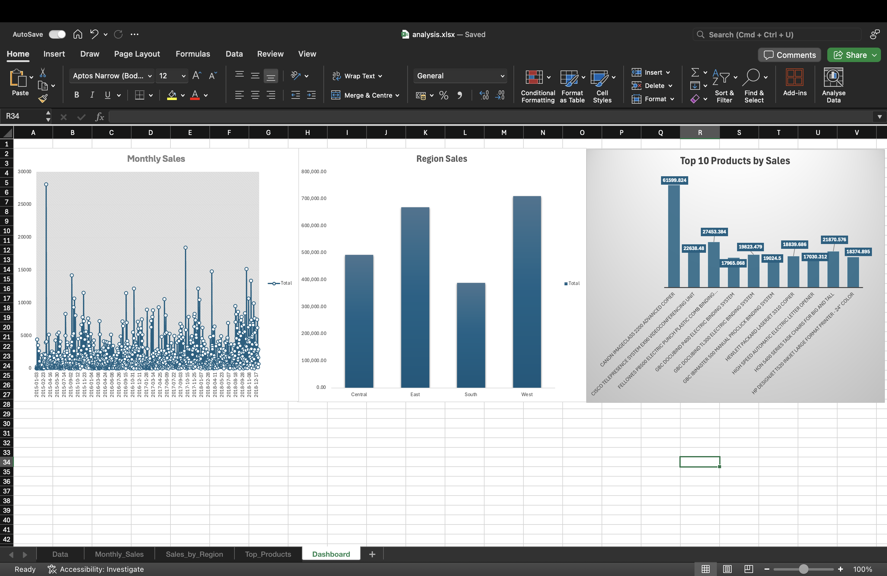

# Retail Sales Dashboard (Excel)

## Project Overview
This project analyzes retail sales data using Microsoft Excel to uncover sales trends,
regional performance, and top-performing products. The goal is to demonstrate practical
data analysis skills including data cleaning, pivot tables, and dashboard creation.

---

## Data Preparation

- Cleaned raw sales data (handled missing values and inconsistent formats)
- Standardized date fields for time-based analysis
- Created calculated fields for revenue and AOV
- Structured data to support pivot tables and dashboard visuals

---

## Dashboard Preview

## Key Business Metrics
- Total Revenue
- Total Orders
- Average Order Value (AOV)
- Monthly Revenue Trend
- Sales by Region
- Top 10 Products by Revenue

---

## Business Questions Answered
- How does revenue change over time on a monthly basis?
- Which regions generate the highest sales?
- Which products contribute the most to overall revenue?

---

## Tools & Excel Features Used

- Pivot Tables & Pivot Charts  
- VLOOKUP / XLOOKUP (if used)  
- Calculated fields  
- Conditional formatting  
- Dashboard layout & chart design

---

## Author
Anam Althaf  
Aspiring Junior Data Analyst
